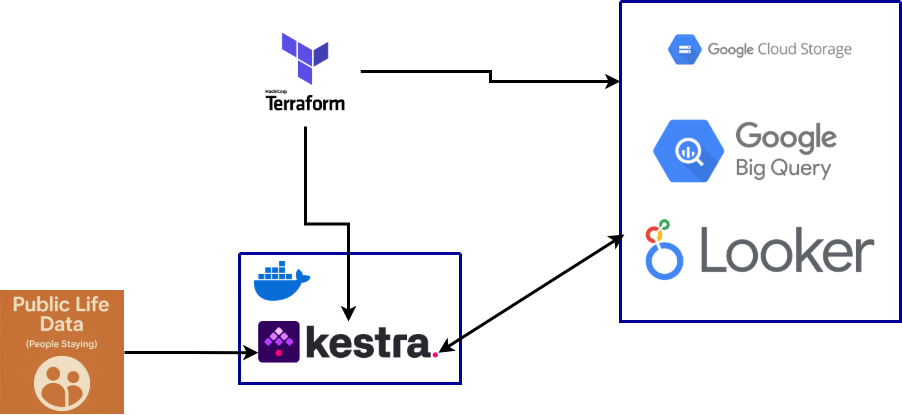
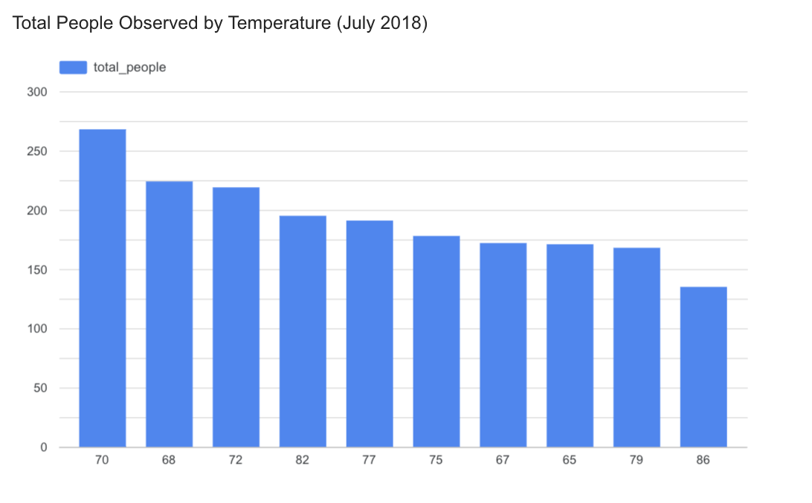
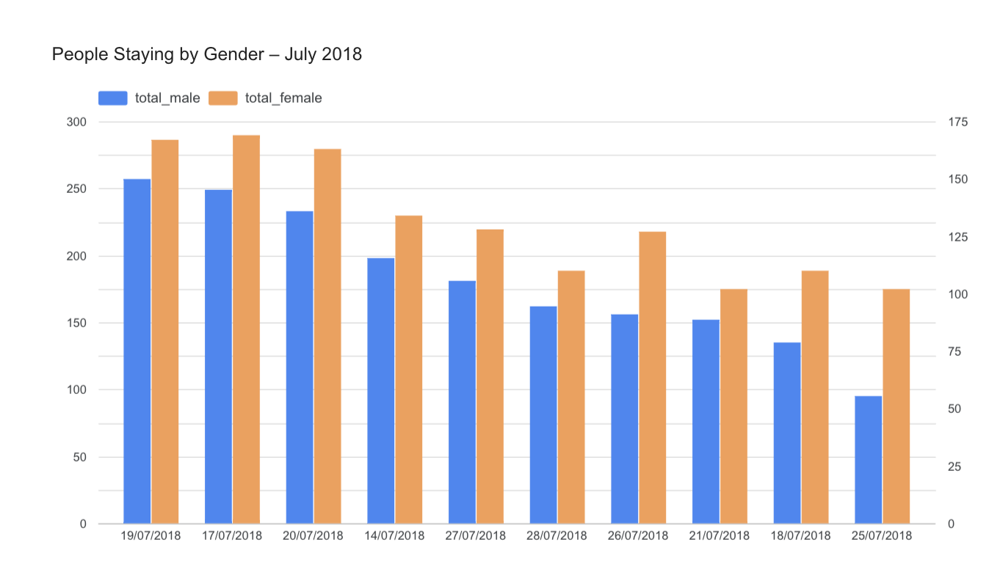

# 🏙️ Data Engineering Project: Public Life Data Pipeline

## 📍 Overview

This project demonstrates a complete data pipeline that processes public life data from Seattle. It includes:

- **Ingestion** of raw data from an open API  
- **Transformation** using Python and BigQuery  
- **Data orchestration** with Kestra  
- **Infrastructure provisioning** with Terraform  
- **Visualization** through an interactive dashboard  

The goal is to showcase end-to-end automation of a real-world dataset for data analysis and urban planning insights.

---

## 📊 Dataset: [Public Life Data (People Staying)](https://data.seattle.gov/Transportation/Public-Life-Data-People-Staying/csd5-77em)

Provided by the Seattle Department of Transportation (SDOT), this dataset captures observations of individuals **staying still** in public spaces, including:

- Timestamps of observation  
- Demographic data (age, gender, mobility status)  
- Group size  
- Postures and activities (e.g., sitting, eating, socializing)  
- Weather conditions  

This data is collected following the [Gehl Institute’s Public Life Data Protocol](https://gehlinstitute.org/tool/public-life-data-protocol/).

---

## 🎯 Objective

To build a reproducible and automated data pipeline that includes:

1. **Extracting data** from the Seattle open data API  
2. **Transforming it** with Python and BigQuery SQL  
3. **Storing** it in optimized BigQuery tables (partitioned and clustered)  
4. **Visualizing** it through an interactive dashboard  

---

## ⚙️ Architecture



---

## 🧰 Tech Stack

| Tool              | Purpose                            |
|-------------------|------------------------------------|
| Terraform         | Infrastructure as code             |
| Kestra            | Workflow orchestration             |
| BigQuery          | Data warehousing and transformation|
| Google Cloud Storage | Intermediate file storage      |
| Looker Studio     | Data visualization                 |

---

## 🚀 How to Run the Pipeline

### 1. Prerequisites

- Google Cloud account with access to BigQuery and GCS  
- Docker installed (for Kestra and Python scripts)  
- [Kestra](https://kestra.io/docs/) running locally or on a server  
- Google Cloud SDK (`gcloud`, `bq`)  
- Billing-enabled GCP project  

---

### 2. Setup Terraform

To create the necessary GCP resources (BigQuery dataset and GCS bucket), you can use the provided Terraform configuration.

This setup will:

- Initialize and apply the Terraform configuration  
- Provision the required GCP infrastructure (GCS bucket and BigQuery dataset)

> ⚠️ **Note**: Make sure you have `terraform` and `gcloud` installed and authenticated, and that your GCP project has billing enabled.

---

```bash
cd terraform/
./setup.sh
```

### 3. Setup Google Cloud Variables in Kestra

Before loading data to GCP, you’ll need to configure the following variables in Kestra’s KV store.

Update the flow file [`gcp_kv.yaml`](kestra/flows/gcp_kv.yaml) with your own values:

- `GCP_CREDS` – Path to your service account credentials  
- `GCP_PROJECT_ID` – Your GCP project ID  
- `GCP_LOCATION` – e.g., `us-west1`  
- `GCP_DATASET` – BigQuery dataset name  
- `GCP_BUCKET_NAME` – GCS bucket name  

> ⚠️ **Important:** Do **not** commit service account credentials to Git. Store them securely and keep them private.

### 4. Run Kestra and import the Flows into Kestra (via UI)

### 4.1 Run Kestra

```bash
cd kestra/
docker compose up -d
```


### 4.2 Import the Flows into Kestra 

Before running the pipeline, you must import both flows into the Kestra UI:

1. Open the [Kestra UI](http://localhost:8080/)
2. Navigate to **Flows** → click **“Import Flow”**
3. Import the following files in order:
   - [`kestra/flows/gcp_kv.yaml`](kestra/flows/gcp_kv.yaml) – loads your GCP credentials and environment variables
   - [`kestra/flows/gcp_public_life_data_load.yaml`](kestra/flows/gcp_public_life_data_load.yaml) – the main data pipeline flow

> ⚠️ **Important:** Be sure to import and run `gcp_kv.yaml` first — it sets the environment variables required by the main pipeline.


### 5. Run the Data Pipeline with Kestra

After importing the flows, you can run the pipeline directly from the Kestra UI.

There are two flows involved:

- [`gcp_kv.yaml`](kestra/flows/gcp_kv.yaml) — Sets your GCP credentials and environment variables  
- [`gcp_public_life_data_load.yaml`](kestra/flows/gcp_public_life_data_load.yaml) — The main data pipeline flow


This flow will:

- Download the dataset via the Seattle Open Data API  
- Clean and transform the data using Python and pandas  
- Save it as a CSV and upload it to your GCS bucket  
- Create an external table in BigQuery  
- Create a partitioned and clustered materialized table for analysis  


### 6. Load with BigQuery CLI 

```bash
bq load \                                                                   
    --source_format=CSV \
    --skip_leading_rows=1 \
    --autodetect \
    project-zoomcamp-457121:public_life_data_seattle_dataset.public_life_data_seattle \
    gs://public-life-data-seattle-bucket/public_life_data.csv

```


### 7. Create the Summary Table in BigQuery

After running the main pipeline flow, you can create an aggregated and optimized table for analysis and dashboarding.

This summary table is partitioned by `date` and clustered by `Temperature`, and contains key aggregated metrics such as total people observed and gender distribution.

```sql
CREATE OR REPLACE TABLE `project-zoomcamp-457121.public_life_data_seattle_dataset.people_staying_summary`
PARTITION BY date
CLUSTER BY Temperature AS
SELECT
    DATE(`Start Time`) AS date,
    Temperature,
    COUNT(*) AS total_people,
    AVG(CAST(Temperature AS FLOAT64)) AS avg_temperature,
    COUNTIF(Gender = "Male") AS total_male,
    COUNTIF(Gender = "Female") AS total_female
FROM
    `project-zoomcamp-457121.public_life_data_seattle_dataset.public_life_data_seattle`
GROUP BY
    date, Temperature;
```

> 💡 **Tip:** Run this query directly in the BigQuery console after Kestra has created the initial raw table.

Once the `people_staying_summary` table is created, you can connect it to Looker Studio to explore and build interactive visualizations.

## 📈 Dashboard

### 👥 Total People Observed by Temperature (July 2018)



## 📊 Key Findings

- 🟦 Most people stayed in public areas when temperatures were around 70°F.
- 🔥 Higher temperatures (80°F+) saw a drop in the number of people observed.
- 📆 Data shown is from July 2018, based on the `people_staying_summary` table.


### 👥 Gender Distribution Over Time (July 2018)



This chart compares the total number of male and female individuals observed staying in public spaces throughout July 2018.

It shows that, overall, the presence of men and women was relatively balanced on most days. However, some fluctuations suggest gendered differences in public space usage on specific dates, which could be further analyzed alongside contextual factors such as weather or events.


## 🧠 Learnings

- How to orchestrate data pipelines with Kestra  
- Working with real-world open data APIs  
- Best practices for BigQuery (partitioning & clustering)  
- Automating infrastructure provisioning with Terraform  

---

## 🛠️ Future Improvements

- Add data quality checks and validations
- Schedule pipeline runs via Kestra  
- Publish the dashboard and make it publicly accessible  

---

## 🔗 Resources

- [Dataset: Public Life Data (People Staying)](https://data.seattle.gov/Transportation/Public-Life-Data-People-Staying/csd5-77em)  
- [Kestra Documentation](https://kestra.io/docs/)  
- [Terraform GCP Provider](https://registry.terraform.io/providers/hashicorp/google/latest/docs)  
- [BigQuery Partitioning & Clustering](https://cloud.google.com/bigquery/docs/partitioned-tables)
